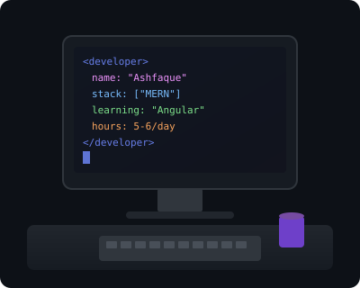
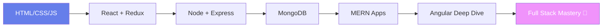

<!-- ═══════════════════════════════════════════════════════════════
     Ashfaque Ali · GitHub Profile README v2
     Self-hosted SVGs · Reliable APIs · Unique sections
     ═══════════════════════════════════════════════════════════════ -->

<div align="center">

<!-- ✅ Self-hosted animated banner — always visible -->


<br/>

<!-- Terminal boot sequence -->


<br/><br/>


&nbsp;

&nbsp;

&nbsp;


</div>

---

## 👨‍💻 About Me

<table>
<tr>
<td width="55%" valign="top">

```javascript
const ashfaque = {
  role: "Full Stack Developer",
  education: "BCA — Bachelor of Computer Applications",
  currentlyLearning: ["Angular", "System Design"],
  askMeAbout: ["MongoDB", "Express", "React", "Node.js", "Angular"],
  funFact: "I spend 5–6 hours learning every single day 🔥",
  email: "aliashfak178@gmail.com",
  pronouns: "he/him"
};
```

</td>
<td width="45%" valign="top" align="center">

<!-- ✅ Self-hosted coder illustration — no external GIF dependency -->


<br/>

**` MERN + Angular Developer `**

</td>
</tr>
</table>

---

## 🧬 Dev DNA — What Makes Me Unique

<table>
<tr>
<td align="center" width="33%">

### 🔥 Obsession Mode
5–6 hours of **daily learning**  
Not a sprint — a lifestyle

</td>
<td align="center" width="33%">

### 🌱 Growth Stack
BCA student actively  
leveling up **Angular + MERN**

</td>
<td align="center" width="33%">

### 🤝 Open Source
Contributing, collaborating  
& building in public

</td>
</tr>
</table>

---

## 💬 Quote Engine — Refreshes on Every Visit

<div align="center">


</div>

---

## 🛠️ Tech Stack

<div align="center">

<!-- Primary icons via skillicons -->


<br/><br/>

<!-- Backup row — individual CDN icons (always load) -->


</div>

---

## ⚡ Skill Radar — Animated Proficiency Map

<div align="center">

<!-- ✅ Unique self-hosted animated skill bars -->


</div>

---

## 📊 GitHub Analytics

<div align="center">

<!-- ✅ Working mirror — official vercel.app often returns 503 -->

&nbsp;&nbsp;


<br/><br/>

<!-- ✅ demolab mirror — herokuapp is deprecated -->


<br/><br/>

<!-- Profile summary cards — verified working -->

&nbsp;&nbsp;


<br/><br/>


&nbsp;&nbsp;


<br/><br/>

<!-- 🌟 UNIQUE: When you code most (IST timezone UTC+5:30) -->


<br/><br/>

<!-- ✅ ghchart — activity-graph.vercel.app returns 402 -->


</div>

---

## 🐍 Contribution Snake

<div align="center">

<!-- Placeholder until workflow runs; then swap src to snake URL below -->


<!--
  After first successful workflow run, replace the img above with:

  <picture>
    <source media="(prefers-color-scheme: dark)" srcset="https://raw.githubusercontent.com/aliashfak178/aliashfak178/output/github-contribution-grid-snake-dark.svg">
    <source media="(prefers-color-scheme: light)" srcset="https://raw.githubusercontent.com/aliashfak178/aliashfak178/output/github-contribution-grid-snake.svg">
    
  </picture>
-->

</div>

---

## 🗺️ Currently Exploring



---

## 🤝 Let's Connect

<div align="center">

<a href="mailto:aliashfak178@gmail.com">
  
</a>
&nbsp;
<a href="https://github.com/aliashfak178">
  
</a>
&nbsp;
<a href="https://www.linkedin.com/in/aliashfak178" target="_blank">
  
</a>

<br/><br/>

<!-- ✅ Self-hosted animated footer -->


</div>
