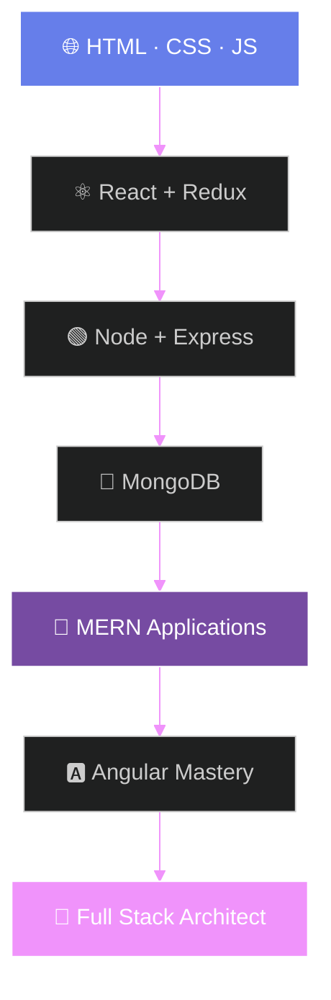

<div align="center">

<!-- ═══ LAYER 1 · Animated neon wave header ═══ -->


<!-- ═══ LAYER 2 · Orbitron hero typing ═══ -->


<!-- ═══ LAYER 3 · Terminal boot typing ═══ -->


<br/>


&nbsp;

&nbsp;

&nbsp;


</div>

<br/>

```diff
+ ╔══════════════════════════════════════════════════════════════════════╗
+ ║  ░▒▓█  DEV COMMAND CENTER  █▓▒░   //  aliashfak178@github  █▓▒░  ║
+ ╚══════════════════════════════════════════════════════════════════════╝
+ [BOOT] kernel loaded · passion module active · learning loop: ON
```

<br/>

<!-- ═══ HUD DASHBOARD · 4 live panels ═══ -->
<table align="center">
<tr>
<td align="center" width="25%">
<br/><br/>
<b>🎯 Mission</b><br/>
Build scalable web apps
</td>
<td align="center" width="25%">
<br/><br/>
<b>📚 Focus</b><br/>
Angular · System Design
</td>
<td align="center" width="25%">
<br/><br/>
<b>⏱️ Daily Grind</b><br/>
5–6 hrs/day coding
</td>
<td align="center" width="25%">
<br/><br/>
<b>🤝 Collab</b><br/>
Open source contributor
</td>
</tr>
</table>

<br/>


<br/>

<details open>
<summary><b>🖥️ &nbsp; cat profile.json — click to collapse</b></summary>
<br/>

```json
{
  "name": "Ashfaque Ali",
  "username": "aliashfak178",
  "role": "Full Stack Developer",
  "education": "BCA — Bachelor of Computer Applications",
  "stack": ["MongoDB", "Express", "React", "Node.js", "Angular"],
  "learning": ["Angular", "System Design", "Scalable Architecture"],
  "email": "aliashfak178@gmail.com",
  "pronouns": "he/him",
  "funFact": "I spend 5–6 hours learning every single day",
  "askMeAbout": "MERN, Angular, MongoDB, REST APIs, Open Source"
}
```

</details>

<br/>


<br/>

<div align="center">


<br/><br/>

<table>
<tr>
<td align="center"><br/><sub>HTML5</sub></td>
<td align="center"><br/><sub>CSS3</sub></td>
<td align="center"><br/><sub>JS</sub></td>
<td align="center"><br/><sub>React</sub></td>
<td align="center"><br/><sub>Angular</sub></td>
<td align="center"><br/><sub>Node</sub></td>
<td align="center"><br/><sub>MongoDB</sub></td>
<td align="center"><br/><sub>Python</sub></td>
</tr>
<tr>
<td align="center"><br/><sub>TF</sub></td>
<td align="center"><br/><sub>C</sub></td>
<td align="center"><br/><sub>C++</sub></td>
<td align="center"><br/><sub>C#</sub></td>
<td align="center"><br/><sub>PHP</sub></td>
<td align="center"><br/><sub>Linux</sub></td>
<td align="center"><br/><sub>Redux</sub></td>
<td align="center"><br/><sub>Sass</sub></td>
</tr>
</table>

</div>

<br/>


<br/>

```yaml
# Live proficiency scan · self-assessed · always updating

JavaScript / TypeScript : ▰▰▰▰▰▰▰▰▰▱  90%  ██████████
React / Redux           : ▰▰▰▰▰▰▰▰▱▱  80%  ████████░░
Node.js / Express       : ▰▰▰▰▰▰▰▱▱▱  75%  ███████░░░
MongoDB                 : ▰▰▰▰▰▰▰▱▱▱  70%  ███████░░░
Angular                 : ▰▰▰▰▰▰▱▱▱▱  60%  ██████░░░░  ← actively leveling up
Python / ML             : ▰▰▰▰▰▰▱▱▱▱  65%  ██████░░░░
C / C++ / C#            : ▰▰▰▰▰▱▱▱▱▱  55%  █████░░░░░
```

<br/>


<br/>

<div align="center">

</div>

<br/>


<br/>

<div align="center">


&nbsp;


<br/><br/>


&nbsp;


<br/><br/>


&nbsp;


<br/><br/>

<!-- 🌟 Rare feature: your peak coding hours in IST -->


<br/><br/>


</div>

<br/>


<br/>



<br/>


<br/>

<div align="center">

<!-- Snake appears after Actions workflow runs -->


<sub>🐍 Snake auto-updates daily via GitHub Actions · Run workflow once if not visible yet</sub>

</div>

<br/>


<br/>

<div align="center">

<a href="mailto:aliashfak178@gmail.com"></a>
<br/><br/>
<a href="https://github.com/aliashfak178"></a>
&nbsp;
<a href="https://www.linkedin.com/in/aliashfak178"></a>

<br/><br/>


<br/><br/>


</div>
